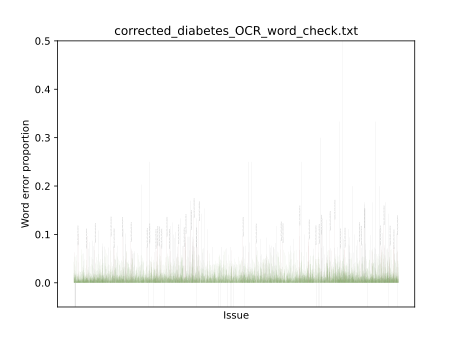

# Customised-OCR-Correction
A word-list based OCR post-correction, originally designed for historical medical text. 

This is a re-implementation of Thompson et al.'s algorithm for OCR post-correction. The implementation is built on the spellchecker "pyspellchecker". "Customised" refers to that suggested corrections are only used if their frequency in the OCR:ed corpus exceeds a cut-off. As a default, a cut-off of 2 is used, (i.e., at least two occurrences are required).

The type of OCR:ed corpus that the algorithm targets is one with a high quality OCR output, but for which it might be relevant to correct some remaining errors.

User-made word lists can be used for the correction. The spellchecker only has built-in word lists for a few languages, so for most languages, user-made word lists are required.

Note that the files are currently expected to consist of one main folder, with subfolders, which contain ".txt-files", i.e. as 

There are some additions to the original algorithm:

a) A word is not replaced if the frequency of the original word in the corpus is higher than the frequency for the spellchecker's suggestion for replacement

b) A compound-splitting of words is also added to the spell checker. What compound splitter to use is configurable, either you can write your own, or use an existing. It is thereby possible to adpat the compound splitting to the language of the text and to choose whether to use a compound splitter that is more a less generous whith flagging words as correct.

c) The algorithm also attempts to locate words that are written with white space between characters and change these to words in which the charachters are not separated by white space.

d) Error statics are also calcualted and plotted

## Programming libraries needed
pip install pyspellchecker

conda install -c anaconda nltk

conda install -c conda-forge matplotlib

(Read more about the spell checker: https://pyspellchecker.readthedocs.io)

## Acknowledgements
This work is part of the research project Acting out Disease: How Patient Organizations Shaped Modern Medicine (ActDisease). More information about the project can be found here: https://www.actdisease.org/

## References
Thompson, P., McNaught, J. and Ananiadou, S. (2015) ‘Customised OCR correction for historical medical text’, in 2015 Digital Heritage. 2015 Digital Heritage, Granada, Spain: IEEE, pp. 35–42. Available at: https://doi.org/10.1109/DigitalHeritage.2015.7413829.

## How we practically have used the code
1. Gather relevant word lists, e.g. from corpora, lexicons and terminologies. One word per row, as in the file 

2. Note the word lists in a file, one list per row, as in 

3. Choose spell checker configuration, eg what compound splitter to use, the maximum edit distance, min occurrences in the OCR:ed corpus

4. Run on the corpus, with the chosen configuration. A number of output files will be created. In the created folder with the suffix '_statistics', there is a file starting with 'not_found'

5. Manually go through the outputfile 'not_found', and add frequent unknown words to the word-lists with known words.  Some of the words will likely be OCR-missinterpretations of common words not in the word lists. (The unknown words are ordered in frequency.)

6. Run the correction functionality once more. This time go through the file 'replacements_made' and make sure that the replacements are correct. For incorrect replacements, you can either add the word on the list of words not to replace (as an argument when running the spellchecker), or add the word to the word-lists. Depending on if it’s more important for you to replace potential incorrect words or make sure not to replace unknown words that are in fact correct, you can choose to manually verify all, or only a subset of the replacements made.
